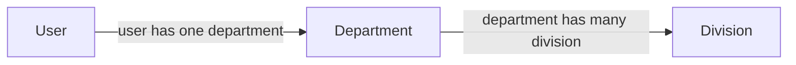

<p align="center"><a href="https://bataxdev.com/projects/btx-btx" target="_blank"></a></p>

<p align="center">
    <a href="https://packagist.org/packages/btx/btx?"></a>
    <a href="https://packagist.org/packages/btx/btx"></a>
    <a href="https://packagist.org/packages/btx/btx"></a>
    <a href="https://packagist.org/packages/btx/btx"></a>
    <a href="https://github.com/bachtiarpanjaitan/btx"></a>
</p>

#### Requirements
* PHP Version : 7.4+
* PHP Modules : GD

#### Tested On
* Lumen

## Instalation
**Install using Composer**

Run command <code>composer require btx/btx</code>, then <code>composer dump-autoload</code>


**Install Manual**

Download repo and extract into your {root project}/packages folder.
```
├── app
├── config
├── database
├── resources
└── packages
    ├── btx
    ...
```
Add this line autoload.psr-4 in your composer.json (You can choose one or all of them)

```
"autoload": {
    "psr-4": {
        ...
        "Btx\\Query\\":"packages/btx/query/src/",
        "Btx\\Common\\":"packages/btx/common/src/",
        "Btx\\Http\\":"packages/btx/http/src/",
        "Btx\\File\\":"packages/btx/file/src/"
    },
    "files": [
        ...
    ]
}

```
Register Service Provider into List of Service Provider.

_lumen_ bootstrap/app.php
```
$app->register(Btx\Query\BtxQueryFilterServiceProvider::class);
$app->register(Btx\Common\BtxCommonServiceProvider::class);
$app->register(Btx\File\BtxFileServiceProvider::class);
$app->register(Btx\Http\BtxHttpServiceProvider::class);
```
_laravel_ config/app.php
```
'providers' => [
    // Other Service Providers
 
    Btx\Query\BtxQueryFilterServiceProvider::class,
    Btx\Common\BtxCommonServiceProvider::class,
    Btx\File\BtxFileServiceProvider::class,
    Btx\Http\BtxHttpServiceProvider::class
],
```
then, dump autoload using command <code>composer dump-autoload</code>.

## Query Service

Now API parameters can be used with the REST API to filter, sort, paginate results, select fields and filtering relation up to 3 deep relationships. Additionally, specific parameters related to optional features can be used.

> NOTE: Only work with SQL database like MySQL, SQLServer, PostgreSQL, SQLite, MariaDB

see [Source Code](https://github.com/bachtiarpanjaitan/btx/blob/main/btx/query/src/Traits/QueryFilter.php)

#### Support Query Filter
| Query | Required | Description | Example|
|--|--|--|--|
| _limit | required | limit data result | _limit: 10|
| _page | required | retrieve data page-n | _page: 1|
| _sort:[column]:[sort type] | optional | sorting data by column| _sort: id:desc or _sort: id:asc|
| [column]_is | optional | get data where column value is [value] |id_is: 5|
| [column]_contain | optional | get data where column value contain [value] |username_contain: admin|
| [column]_gte | optional | get data where column value greater than or equal with [value] |age_gte: 25|
| [column]_lte | optional | get data where column value less than or equal with [value] |age_lte: 25|
| [column]_gt | optional | get data where column value greater than [value] |age_gt: 25|
| [column]_lt | optional | get data where column value less than [value] |age_lt: 25|
| [column]_ne | optional | get data where column value not equal with [value] |gender_ne: male|
| [column]_between | optional | get data where column value between [values] |age_between: 20,30|
| [column]_null | optional | get data where column is null | address_null |
| [column]_notnull | optional | get data where column is not null | address_notnull |
| [column]_in | optional | get data where column value in [values] | age_in: 10,25,30|
| [column]_notin | optional | get data where column value not in [values] | age_notin: 10,25,30|

#### Query Filter in Relationship Database
Even query can filter data in relationship table up to 3 deep table relationship. Example 2 deep relationship data

and your user model and department model must be:
```
//user model
class User extends Model
{
   ...
   public function department(){
      return $this->hasOne(Department::class,'id');
   }
   ...
}

//Department model
class Department extends Model
{
   ...
   public function division(){
      return $this->hasMany(Division::class);
   }
   ...
}
```

so, to filter data using department name or division name from user list you can using parameter with *__* (double underscore) like:
| Param Key | Description| Example |
|--|--|--|
|department__name_is| filter user using department name where department name is [value] | department__name_is:production |
|department__division__name_is| filter user using division name where division name is [value] | department__division__name_is: it |

#### Example using trait
- Import Trait From Btx Package in your controller with `use Btx\Query\Traits\QueryFilter;`
- Implement the trait `use QueryFilter`
- Before query executing use function on trait `$this->filter(Model)`

Example:
```
use Btx\QueryFilter\Traits\QueryFilter; 
class UserController extends Controller(){
   use QueryFilter;

   public function getUsers(Request $request){
        $users = User::with('department');
        $this->filter($users);
        $users->get();

        return response()->json(['data' => $users]);
   }
   
}

```

#### Example using extending model class
- Import Btx\Query\Model From Btx Package in your model with override existing Model class
- Before query executing use function `filter()`

Example:
```
//Model
use Btx\Query\Model;
class User extends Model
{
  public function department(){
    return $this->hasOne(Department::class,'id','department_id');
  }
  ...
}

//Controller
class UserController extends Controller(){

   public function getUsers(Request $request){
        //implement filter function
        $users = User::with('department')->filter()->get();
        return response()->json(['data' => $users]);
   }
   
}

```
## Http Service
#### Using StaticResponse
StaticResponse.php use for generalization response code, actually extend function from [Http\Libraries\ApiResponse](https://github.com/bachtiarpanjaitan/btx/blob/main/btx/http/src/Libraries/ApiResponse.php)

> Available methods
- _fakeResponse(status = 200, message, data)_
    - To make response 200 (OK)
    - **@param** *status* code
    - **@param** *message* message response
    - **@param** *data* data response
    - **@return** array
- _response200(message, data)_
    - To make fake response for testing
    - **@param** *message* message response
    - **@param** *data* data response
    - **@return** array
- _response301(appendText, appendTextdir)_
    - To make response 301 (move permanently)
    - **@param** *appendText* append text direction to response
    - **@param** *appendTextDir* text
    - **@return** array
- _response400(appendText, appendTextdir)_
    - To make response 400 (bad request)
    - **@param** *appendText* append text direction to response
    - **@param** *appendTextDir* text
    - **@return** array
- _response401()_
    - To make response 401 (error Unauthorized)
    - **@param** array
- _response404(appendText, appendTextdir)_
    - To make response 404 (error not found)
    - **@param** *appendText* append text direction to response
    - **@param** *appendTextDir* text
    - **@return** array
- _response405(appendText, appendTextdir)_
    - To make response 405 (method not allowed)
    - **@param** *appendText* append text direction to response
    - **@param** *appendTextDir* text
    - **@return** array
- _response500(appendText, data)_
    - To make response 404 (server error)
    - **@param** *appendText*append text to response
    - **@return** array

#### Example

```
use Btx\Http\Traits\StaticResponse;

class BlogService {
    use StaticResponse;

    /** function to get data blog by id */
    ...
        $result = Blog::findOrFail($req->id);
        if(empty($result) $this->response400('Sorry, data request not found')
    ...
}

```

### Using Class Response
#### Available Methods
| method | Description |
|--|--|
| ok(text,data,appendData) | status code 200 |
| badRequest(text,direction) | status code 400 |
| movedPermanently(text,direction) | status code 301 |
| unauthorized() | status code 401 |
| notFound(text,direction) | status code 404 |
| notAllowed(text,direction) | status code 405 |
| internalServerError(text,data) | status code 500 |

#### Example

```
use Btx\Http\Response;

class BlogService {

    /** function to get blogs */
    ...
        $results = Blog::all();
        if(!empty($result) Response::ok('Loaded',$results)
    ...
}

```

## Common Service
#### Available Methods
| Methods | Class | Description |
|--|--|--|
| generate(number, language) | SpellNumber | Spelling number into another language. Available language: id (default)|
| onCoordinateRadius(needle, haystack) | Map | To determine the coordinates are within a predetermined radius in meter|

##### Example

###### SpellNumber::generate()

Spelling number 225000

```
use Btx\Common\SpellNumber;
use Btx\Http\Response;

class UserController {

    /** function to spelling a number */
    ...
        $number = 225000;
        $spell = SpellNumber::generate($number);
        //$spell must be : "Dua Ratus Dua Puluh Lima Ribu"
        Response::ok('Uploaded',$spell)
    ...
}

```

See detail documentations on [Btx Documentation](https://btx.bataxdev.com)

